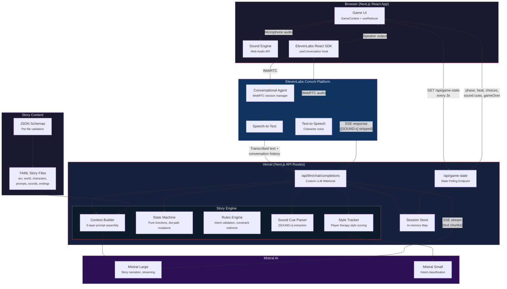
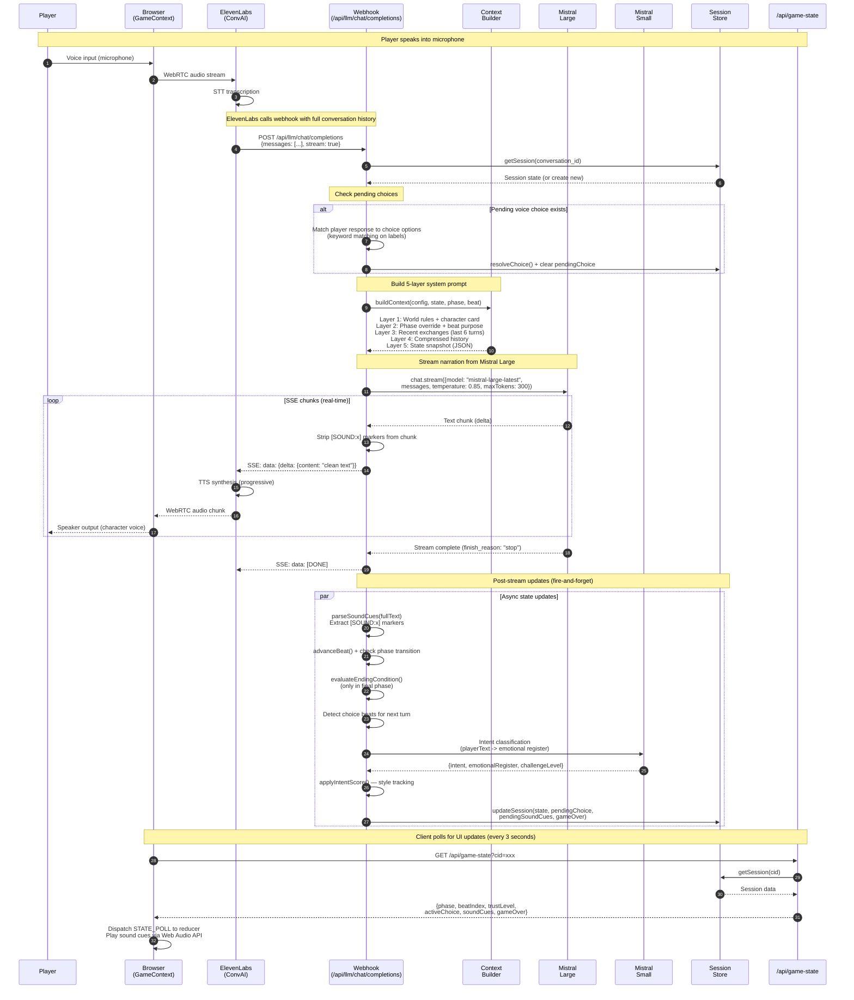

# InnerPlay

### Close Your Eyes. Speak. Play.

A voice-only immersive game engine where the screen goes dark and your imagination becomes the renderer. No buttons, no visuals, no text boxes -- just your voice, AI characters that listen and respond, and a soundscape that builds a world inside your head. Powered by **Mistral AI** for narration and **ElevenLabs** for real-time voice.

**[Play the live demo](https://mistral-lac.vercel.app)** -- put on headphones.

---

## The Experience

You put on headphones. You close your eyes. A voice says:

> *"Close your eyes... take a breath in..."*

Ambient sound layers fade in -- rain on glass, a clock ticking, the hum of an elevator. You are a therapist. Your patient, Elara, has arrived for a late-night emergency session. She is calm. Too calm.

You speak naturally. She responds in real-time -- not with canned dialogue trees, but with contextual, emotionally aware narration generated by Mistral Large. The game engine tracks your behavior, your choices, your therapy style. Sounds disappear one by one. The building goes silent. And then Elara starts asking *you* the questions.

The entire interface is your voice and your imagination.

---

## Stories

The engine ships with three complete stories. Each is a self-contained YAML content pack -- the engine is genre-agnostic.

| Story | Genre | Duration | Mood | You Play As |
|-------|-------|----------|------|-------------|
| **The Last Session** | Psychological horror | ~12 min | Intimate, cerebral, unsettling | Therapist |
| **The Lighthouse** | Cosmic isolation horror | ~10 min | Isolated, cosmic, unsettling | Lighthouse keeper |
| **Room 4B** | Institutional surreal horror | ~10 min | Clinical, oppressive, surreal | Security guard |

**The Last Session** is the flagship experience:
- 5 phases of escalating tension
- 3 choice points with natural language input (not "option A or B")
- 4 revelation variants based on your therapy style (empathetic, analytical, nurturing, confrontational)
- 17 possible endings evaluated by a deterministic rules engine
- One moment where your agency is revoked -- you said stay silent, but your voice came out anyway

---

## How It Works

```
Player speaks into microphone
       |
       v
ElevenLabs ConvAI (WebRTC) -- real-time STT, VAD, turn-taking
       |
       v
Custom LLM Webhook (/api/llm/chat/completions)
       |
       v
5-Layer Context Builder -- world rules, character card, phase override, history, live state
       |
       v
Mistral Large -- streaming narration with [SOUND:x] markers (temp 0.85, 300 token cap)
       |
       v
SSE Stream -- tokens flow to ElevenLabs in real-time, sound markers stripped before TTS
       |
       v
ElevenLabs TTS -- converts to character voice with emotional expression
       |
       v
Web Audio API -- mixes voice + ambient layers + spatial sound + dynamic ducking
       |
       v
Player hears a living world through headphones
```

**Post-stream (fire-and-forget, never blocks voice):** Sound cues fire. Beat advances. Phase transitions evaluate. Player style scores accumulate. Ending conditions check. The state machine runs deterministically -- the AI never decides game logic.

---

## Mistral AI Integration

Mistral is the brain of InnerPlay. Two models, two distinct roles.

### Mistral Large -- Story Narration

- Generates all in-character dialogue and narration via **token-by-token streaming**
- Respects world rules, character constraints, and phase behavior directives
- Produces `[SOUND:remove_hvac]` markers inline -- parsed for game state, stripped before TTS
- Temperature **0.85** for creative but grounded output
- **300 token cap** per turn for natural conversational pacing
- Player hears the first words while the rest of the response is still generating

### Mistral Small -- Intent Classification

- Classifies every player utterance: **11 intent categories** + **5 emotional registers** + challenge level
- Runs **async after** the response streams -- never blocks the voice pipeline
- Feeds the **player style tracker**: empathetic / analytical / nurturing / confrontational scores accumulate
- At Phase 4, the dominant style selects which of 4 revelation variants the player experiences

### 5-Layer Context System

The context builder assembles a ~1,600 token system prompt per turn:

| Layer | Content | Purpose |
|-------|---------|---------|
| 1 | World rules + character card | Immutable constraints (~600 tokens) |
| 2 | Phase behavior override | How the character acts RIGHT NOW (~300 tokens) |
| 3 | Recent exchanges (last 6 turns) | Short-term memory (~400 tokens) |
| 4 | Compressed earlier history | Long-term context (~200 tokens) |
| 5 | Live state JSON | Trust, secrets, sounds, choices, style scores (~100 tokens) |

### Design Philosophy: Code Decides, LLM Narrates

The state machine, rules engine, and ending evaluator are **pure TypeScript functions**. Mistral never hallucinates game state because it never controls game state. The LLM's only job is to narrate what the deterministic engine has decided.

---

## Architecture



### Request Pipeline (Single Turn)



### Pipeline Timing

| Step | Latency | Notes |
|------|---------|-------|
| STT (ElevenLabs) | ~300ms | Real-time transcription via WebRTC |
| Webhook processing | ~5-15ms | Session lookup, choice matching, context building |
| Mistral Large first chunk | ~500-800ms | Time to first SSE chunk (streaming) |
| TTS (ElevenLabs) | ~200ms | Progressive synthesis starts on first sentence |
| Intent classification | ~200-400ms | Mistral Small, runs async post-stream |

**Total voice-to-voice latency: ~1-1.5 seconds**

---

## Tech Stack

| Component | Technology | Version |
|-----------|-----------|---------|
| Framework | Next.js (React, TypeScript, App Router) | 16.1.6 |
| AI Narration | Mistral Large | `mistral-large-latest` |
| Intent Classification | Mistral Small | `mistral-small-latest` |
| Voice I/O | ElevenLabs Conversational AI (WebRTC, STT, TTS) | `@elevenlabs/react` 0.14.1 |
| Mistral SDK | `@mistralai/mistralai` | 1.5.0 |
| Audio Engine | Web Audio API | Spatial sound, ambient layers, dynamic mixing |
| Story Content | YAML | 31 files, 14,000+ lines across 3 stories |
| Source Code | TypeScript | 34 files |
| Schema Validation | Ajv | 8.18.0 |
| Deployment | Vercel | Serverless |

---

## Quick Start

```bash
git clone https://github.com/AkashiGhost/mistral.git
cd mistral
npm install
cp .env.example .env.local
```

Add your API keys to `.env.local`:

```
MISTRAL_API_KEY=your_mistral_api_key
ELEVENLABS_API_KEY=your_elevenlabs_api_key
NEXT_PUBLIC_ELEVENLABS_AGENT_ID=your_agent_id
```

The ElevenLabs agent must be configured with a **Custom LLM webhook** pointing to:
```
https://<your-domain>/api/llm
```

Then run:

```bash
npm run dev
```

Open [http://localhost:3000](http://localhost:3000). Put on headphones. Close your eyes.

---

## Project Structure

```
src/
  app/
    api/
      llm/chat/completions/   Custom LLM webhook (Mistral streaming + game engine)
      game-state/              Client polls for state updates (choices, sounds, phase)
      choice/                  Choice submission endpoint
      signed-url/              ElevenLabs signed URL for agent connection
    play/                      Game session page
    page.tsx                   Landing / story selection
  components/game/
    GameSession.tsx            Core gameplay component (ElevenLabs + sound + state)
    OnboardingFlow.tsx         Eyes-closed ritual entry
    ChoiceDisplay.tsx          Voice choice prompts
    AtmosphereLayer.tsx        Visual atmosphere (pre-gameplay)
  context/
    GameContext.tsx             React context + useReducer for client state
  hooks/
    useSoundEngine.ts          Web Audio API hook
  lib/
    llm/
      mistral-adapter.ts       Mistral Large streaming + Mistral Small intent classification
      context-builder.ts       5-layer prompt assembly
      mock-adapter.ts          Offline testing adapter
    state-machine.ts           Pure function state management
    rules-engine.ts            Intent validation, constraint enforcement
    config-loader.ts           Multi-story config loading with caching
    story-loader.ts            YAML parsing + per-file schema validation
    sound-engine.ts            Web Audio API: spatial channels, ducking, timelines
    sound-cue-parser.ts        [SOUND:x] marker extraction
    style-tracker.ts           Player therapy style scoring
    session-store.ts           In-memory session state (30-min TTL)
    types/                     40+ TypeScript interfaces across 5 files

stories/
  the-last-session/            Psychological horror -- 12 min, therapist role
  the-lighthouse/              Cosmic isolation -- 10 min, lighthouse keeper role
  room-4b/                     Institutional surreal -- 10 min, security guard role

schemas/                       JSON schemas for per-file YAML validation
```

---

## What Makes This Different

**Zero-UI gameplay.** The screen goes dark. Your imagination is the renderer. Nothing like it exists in the AI space.

**Code decides, LLM narrates.** Game logic is deterministic TypeScript. Mistral handles narration only. No hallucinated game states, no narrative drift, no broken puzzles.

**Stories are data, not code.** 31 YAML files define a complete story -- world rules, character cards, phase behaviors, sound timelines, ending conditions. New stories require zero engine changes.

**Style tracking changes the story.** The game tracks not just *what* you choose but *how* you play. An empathetic player gets a fundamentally different revelation than a confrontational one.

**Subtractive sound design.** Horror through removal. Sounds disappear one by one -- elevator hum, footsteps, HVAC, clock -- until only rain remains. Then 2 seconds of absolute silence. Your brain fills the void with dread.

---

## Team

Solo developer -- **Akash Manmohan**

---

## Links

- **Live Demo**: [https://mistral-lac.vercel.app](https://mistral-lac.vercel.app)
- **Repository**: [https://github.com/AkashiGhost/mistral](https://github.com/AkashiGhost/mistral)
