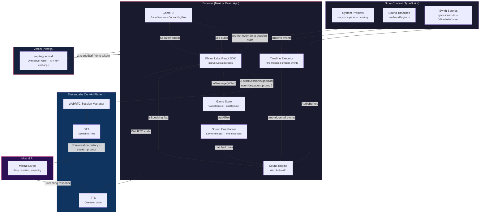
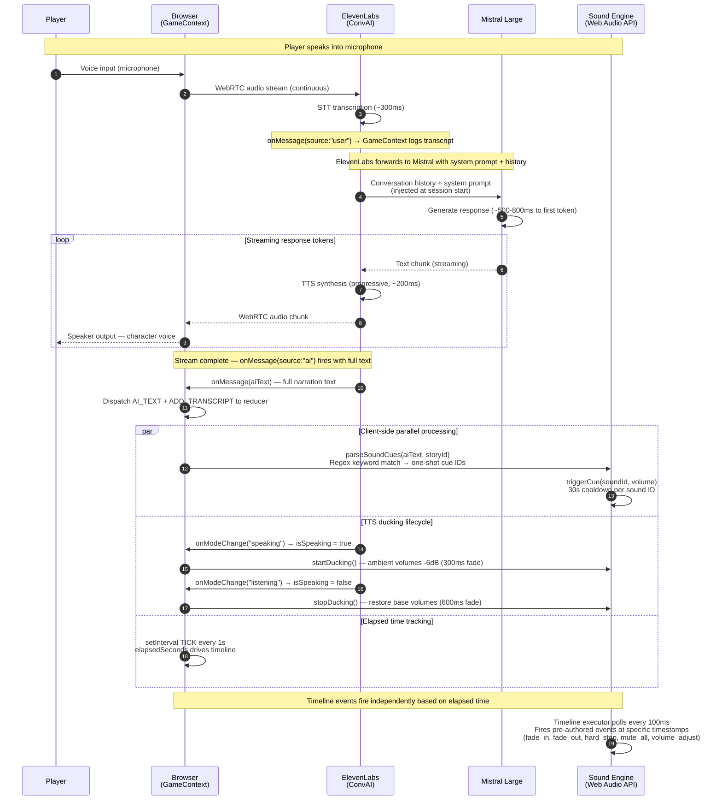

<div align="center">
  
  <p><strong>Close Your Eyes. Speak. Play.</strong></p>
</div>

A voice-only immersive game engine where the screen goes dark and your imagination becomes the renderer. No buttons, no visuals, no text boxes -- just your voice, AI characters that listen and respond, and a soundscape that builds a world inside your head. Powered by **Mistral AI** for narration and **ElevenLabs** for real-time voice.

**[Play the live demo](https://mistral-lac.vercel.app)** -- put on headphones.

---

## The Experience

Three scene images set the stage. Then a single prompt: put on headphones.

A 3-second countdown. The screen goes black. A phone rings -- synthesized in-browser, North American ring tone, no audio files.

Then silence. Then:

> *"Hello?? Oh god, someone picked up. Please -- please don't hang up."*

You are the only contact on the phone of someone who just woke up in a concrete room underground. They don't know how they got there. You don't know their name yet. The AI plays Alex in real-time -- not a choice tree, not canned responses, but contextually aware narration generated by Mistral Large and voiced by ElevenLabs. Ambient sound layers build as the call continues: phone static, electrical hum, the low throb of something deep below. The soundscape reacts to what Alex describes -- keyword detection fires sound cues from natural narration. A pre-authored timeline drives the atmosphere arc in parallel.

No text. No buttons. No visual UI. Your voice and your imagination, nothing else.

You are their only way out. Wrong choices loop back to the start -- and Alex starts to remember.

---

## Stories

The engine ships with one fully playable story and three in development.

| Story | Genre | Duration | Mood | You Play As | Status |
|-------|-------|----------|------|-------------|--------|
| **The Call** | Thriller | ~10 min | Tense, intimate, urgent | Caller's only contact | **Playable now** |
| **The Last Session** | Psychological horror | ~12 min | Intimate, cerebral, unsettling | Therapist | Coming soon |
| **The Lighthouse** | Cosmic isolation horror | ~10 min | Isolated, cosmic, unsettling | Lighthouse keeper | Coming soon |
| **Room 4B** | Institutional surreal horror | ~10 min | Clinical, oppressive, surreal | Security guard | Coming soon |

**The Call** is the flagship experience:
- Natural conversation -- no "option A or B"
- Dual-layer sound system: authored timeline + AI keyword detection
- Phone ring during onboarding, pickup click when the character first speaks
- All audio synthesized in-browser via Web Audio API -- no files to load

---

## How It Works

```
Player speaks into microphone
       |
       v
ElevenLabs ConvAI (WebRTC) -- real-time STT, VAD, turn-taking
       |
       v
ElevenLabs sends conversation history + system prompt to Mistral Large directly
(system prompt injected at session start from story-prompts.ts via client-side override)
       |
       v
Mistral Large -- streams in-character narration
       |
       v
ElevenLabs TTS -- converts to character voice with emotional expression
       |
       v
WebRTC audio returns to browser

In parallel (client-side, no server involvement):
  - Keyword regex runs on AI narration text → reactive sound cues fire
  - Timeline executor polls every 100ms → ambient layer progression
  - TTS ducking: -6dB when character speaks, restore when she stops
       |
       v
Player hears a living world through headphones
```

**There is no server in the voice path.** The only API route is `/api/signed-url`, which exchanges the secret `ELEVENLABS_API_KEY` for a short-lived signed URL. All game state lives in a React `useReducer` in the browser.

---

## Mistral AI Integration

Mistral Large is the voice of every character in InnerPlay.

### Mistral Large -- Story Narration

- Called directly by ElevenLabs -- no custom webhook, no intermediate server
- System prompt injected at session start via `overrides.agent.prompt.prompt` -- loaded client-side from `src/lib/story-prompts.ts`
- Generates all in-character dialogue via **token-by-token streaming** -- player hears the first word while the rest generates
- Story prompts encode character voice, phase arc, forbidden phrases, and ending guidance in a single authored string

### Story System Prompt Design

Each story prompt does the work that was previously spread across multiple components:

| Concern | How It's Handled |
|---------|-----------------|
| Character voice | Explicit tone rules, forbidden phrases, sentence length caps |
| Phase progression | Self-managed by model based on exchange count guidance |
| World rules | Embedded in prompt (what exists, what the character knows) |
| Sound integration | Model narrates naturally -- keyword system handles audio |
| Ending | Model guided to conclude at appropriate exchange depth |

### Design Philosophy: Code Decides the Soundscape, LLM Narrates the Story

The timeline executor, keyword matcher, and TTS ducking system are deterministic TypeScript. Mistral's only job is to be the character. It never controls sound, never emits `[SOUND:x]` markers, never manages state.

---

## Architecture



### Request Pipeline (Single Turn)



### Pipeline Timing

| Step | Latency | Notes |
|------|---------|-------|
| STT (ElevenLabs) | ~300ms | Real-time transcription via WebRTC VAD |
| Mistral Large first token | ~500-800ms | Streaming -- TTS starts on first sentence |
| TTS progressive synthesis | ~200ms | ElevenLabs synthesizes as tokens arrive |
| **Total voice-to-voice** | **~1-1.5s** | Player speaks → character responds |
| Sound cue parsing | <5ms | Client-side regex, runs after full text received |
| TTS duck fade-in | 300ms | Ambient -6dB when character starts speaking |
| TTS duck restore | 600ms | Ambient returns to base when character stops |

---

## Tech Stack

| Component | Technology | Version |
|-----------|-----------|---------|
| Framework | Next.js (React, TypeScript, App Router) | 16.1.6 |
| AI Narration | Mistral Large (via ElevenLabs agent config) | `mistral-large-latest` |
| Voice I/O | ElevenLabs Conversational AI (WebRTC, STT, TTS) | `@elevenlabs/react` 0.14.1 |
| Client State | React useReducer (GameContext) | No server session store |
| Audio Engine | Web Audio API | Spatial sound, ambient layers, OfflineAudioContext synthesis |
| Story Content | TypeScript | System prompts, timelines, keyword rules |
| Source Code | TypeScript | ~40 files |
| Server Routes | Next.js API Route | 1 route: `/api/signed-url` |
| Deployment | Vercel | Serverless |

---

## Quick Start

```bash
git clone https://github.com/AkashiGhost/mistral.git
cd mistral
npm install
cp .env.example .env.local
```

Add your API keys to `.env.local`:

```
ELEVENLABS_API_KEY=your_elevenlabs_api_key
NEXT_PUBLIC_ELEVENLABS_AGENT_ID=your_agent_id
```

The ElevenLabs agent must be configured with **Mistral Large** as the LLM and client-side prompt overrides enabled in the Security tab.

Then run:

```bash
npm run dev
```

Open [http://localhost:3000](http://localhost:3000). Put on headphones. Close your eyes.

---

## Project Structure

```
src/
  app/
    api/
      signed-url/        Only server route — exchanges ELEVENLABS_API_KEY for signed URL
    play/                Game session page
    stories/             Story selection page
    page.tsx             Landing page
  components/game/
    GameSession.tsx      Core gameplay component (ElevenLabs + sound + state)
    OnboardingFlow.tsx   Eyes-closed ritual entry (phone ring → pickup → session start)
    ChoiceDisplay.tsx    Voice choice prompts
    AtmosphereLayer.tsx  Visual atmosphere (pre-gameplay only)
  context/
    GameContext.tsx      React useReducer — all game state, ElevenLabs session management
  hooks/
    useSoundEngine.ts    Sound engine lifecycle, timeline definitions, keyword cue handling
  lib/
    story-prompts.ts     Per-story system prompt strings (injected at session start)
    story-data.ts        Story metadata (title, hook, duration, playable status)
    sound-engine.ts      Web Audio API: spatial channels, ducking, timeline execution
    synth-sounds.ts      OfflineAudioContext sound generation (all sounds, no audio files)
    sound-cue-parser.ts  Keyword regex rules per story → one-shot sound cue IDs
    state-machine.ts     Pure TypeScript state helpers
    constants.ts         Story IDs, DEFAULT_STORY_ID
    types/               TypeScript interfaces
```

---

## What Makes This Different

**Zero-UI gameplay.** The screen goes dark. Your imagination is the renderer. Nothing like it exists in the AI space.

**Direct-wire architecture.** ElevenLabs calls Mistral directly. No webhook, no server session store, no polling. The system prompt is the entire game engine contract -- injected once at session start. Voice-to-voice latency is ~1-1.5 seconds.

**Dual sound system.** A deterministic timeline authors the atmosphere arc (HVAC fades at minute 3:30, static intensifies at minute 5). A keyword detection layer fires reactive cues from natural AI narration (model says "footsteps in the corridor" → footsteps play). Both run client-side, both are pure TypeScript.

**All sounds synthesized in-browser.** No audio files. No CDN. Every ambient layer and one-shot cue is generated procedurally via `OfflineAudioContext`. The sound palette is parameterized TypeScript that loads in under 3 seconds.

**Subtractive sound design.** Horror and tension through removal. Sounds disappear. Static intensifies. The line degrades. Your brain fills the void.

---

## Team

Solo developer -- **Akash Manmohan**

---

## Links

- **Live Demo**: [https://mistral-lac.vercel.app](https://mistral-lac.vercel.app)
- **Repository**: [https://github.com/AkashiGhost/mistral](https://github.com/AkashiGhost/mistral)
