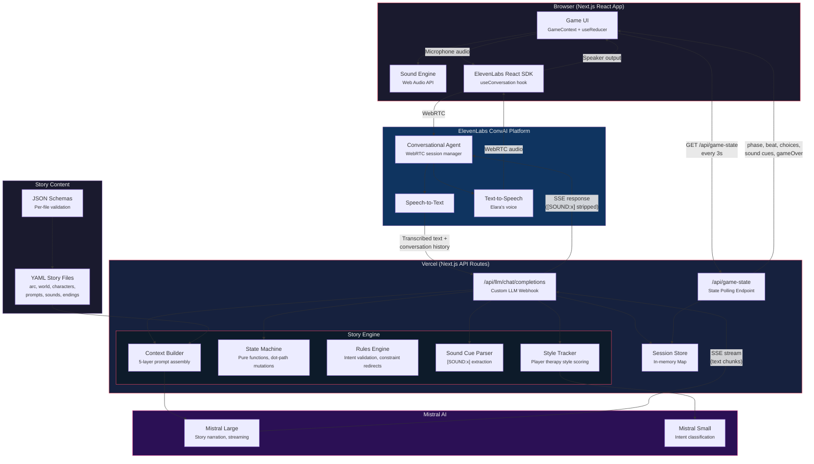
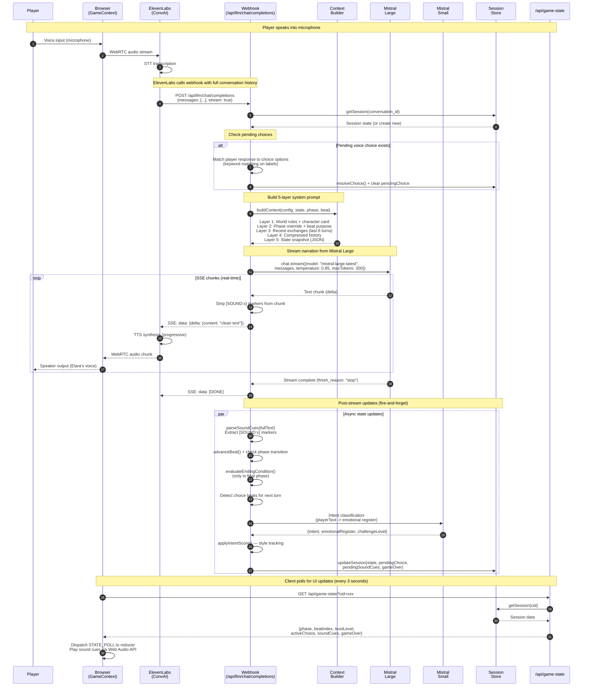

# InnerPlay Architecture

**Voice-based immersive horror game powered by Mistral AI + ElevenLabs Conversational AI**

The player speaks into their microphone. ElevenLabs handles real-time STT and TTS via WebRTC. Our webhook injects the story engine (state machine, rules, context builder) and streams Mistral Large responses back as SSE. The client polls for game state updates (choices, sound cues, phase transitions) on a separate channel.

---

## System Architecture

### Component Summary

| Component | Technology | Role |
|-----------|-----------|------|
| **Game UI** | Next.js 16 + React + useReducer | Manages client state, renders choices, controls sound |
| **ElevenLabs ConvAI** | WebRTC, STT, TTS | Voice I/O -- transcribes speech, synthesizes Elara's voice |
| **Custom LLM Webhook** | Next.js API Route (Node.js runtime) | Receives conversation history, injects story context, streams Mistral response |
| **Context Builder** | TypeScript, 5-layer prompt | Assembles world rules + character card + phase override + history + state snapshot |
| **State Machine** | Pure functions, immutable state | Tracks phase/beat progression, choice resolution, ending evaluation |
| **Rules Engine** | Constraint matching | Validates player intents against world physics rules |
| **Sound Cue Parser** | Regex extraction | Extracts `[SOUND:x]` markers from LLM output, strips before TTS |
| **Style Tracker** | Scoring system | Tracks player therapy style (empathetic/analytical/nurturing/confrontational) |
| **Session Store** | In-memory Map | Per-conversation state, 30-min TTL, keyed by ElevenLabs conversation_id |
| **Mistral Large** | `mistral-large-latest` | Story narration -- streaming responses with sound cue markers |
| **Mistral Small** | `mistral-small-latest` | Intent classification -- fast, cheap, runs post-stream |
| **Story YAML** | 8+ YAML files per story | Pre-authored narrative structure: phases, beats, choices, endings, character arcs |

---

## Request Pipeline (Single Turn)

### Pipeline Timing

| Step | Latency | Notes |
|------|---------|-------|
| STT (ElevenLabs) | ~300ms | Real-time transcription via WebRTC |
| Webhook processing | ~5-15ms | Session lookup, choice matching, context building |
| Mistral Large first chunk | ~500-800ms | Time to first SSE chunk (streaming) |
| TTS (ElevenLabs) | ~200ms | Progressive synthesis starts on first sentence |
| Intent classification | ~200-400ms | Mistral Small, runs async post-stream |
| State poll | 3s interval | Non-blocking, UI update channel |

**Total voice-to-voice latency: ~1-1.5 seconds** (STT + webhook + Mistral first chunk + TTS)

---

## Key Design Decisions

1. **ElevenLabs as voice backbone** -- WebRTC handles STT/TTS, custom LLM webhook lets us inject our game engine between transcription and speech synthesis.

2. **Streaming SSE** -- Mistral chunks flow directly to ElevenLabs TTS. Post-stream state updates (sound cues, beat advancement, style tracking) run fire-and-forget after the SSE connection closes.

3. **[SOUND:x] markers** -- Mistral embeds sound cues in its text output. The webhook strips them before forwarding to TTS (so Elara does not say "SOUND colon door creak"). Cues are stored in session state and delivered to the client via polling.

4. **In-memory session store** -- Game sessions last 10-12 minutes max. A simple Map keyed by conversation_id is sufficient. Cold-start reset is acceptable for a hackathon.

5. **Dual Mistral models** -- Large for narration (creative, streaming), Small for intent classification (fast, cheap, async). The intent classifier runs post-stream so it never blocks voice output.

6. **5-layer context** -- System prompt is assembled fresh each turn from world rules, character card, phase overrides, recent exchanges, compressed history, and live state snapshot. This keeps Mistral grounded in the story structure while allowing creative narration.
