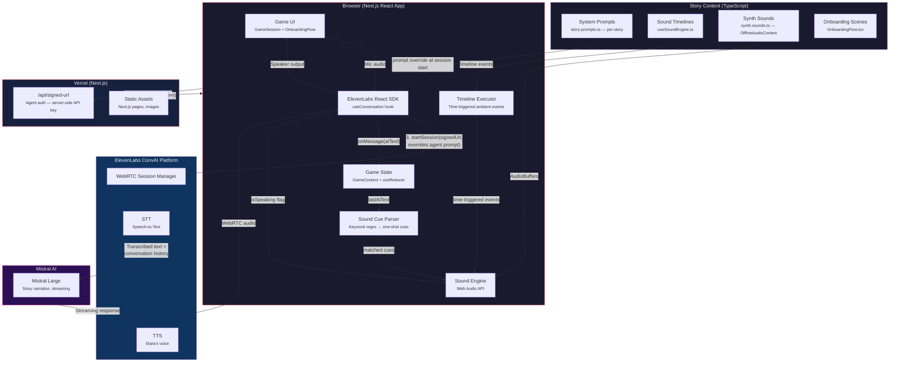
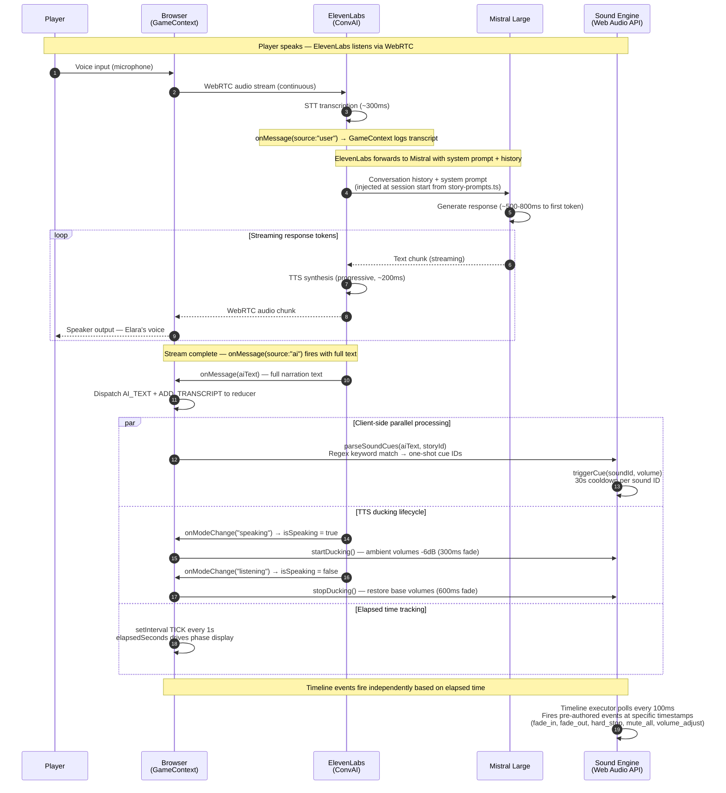
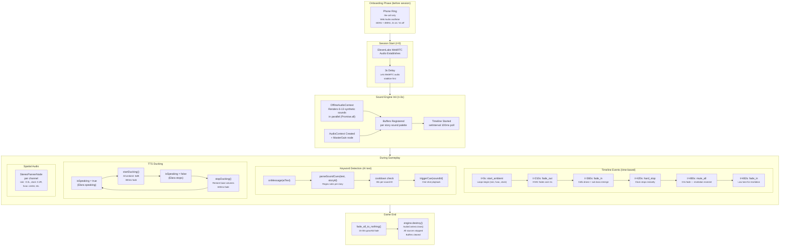

# InnerPlay Architecture

**Voice-based immersive horror game powered by Mistral AI + ElevenLabs Conversational AI**

The player speaks into their microphone. ElevenLabs handles real-time STT and TTS via WebRTC, calling Mistral Large directly with a system prompt injected by the client at session start. There is no custom webhook in the voice path. All game state lives in the browser. Sound is driven by a client-side timeline and keyword detection on AI narration text.

---

## Diagram 1: System Architecture (High-Level)

### Component Summary

| Component | Technology | Role |
|-----------|-----------|------|
| **Game UI** | Next.js 16, React, GameSession, OnboardingFlow | Renders transcript overlay, breathing indicator, pause/end controls, onboarding scenes |
| **Game State** | React useReducer (GameContext) | Tracks status, elapsed seconds, isSpeaking, transcript, conversationId — entirely client-side, no server sync |
| **ElevenLabs React SDK** | `@elevenlabs/react` useConversation | Owns WebRTC session: mic capture, STT, TTS playback, onMessage/onModeChange callbacks |
| **ElevenLabs ConvAI** | WebRTC, STT, TTS | Real-time voice I/O — transcribes player speech, calls Mistral directly, synthesizes Elara's voice |
| **Mistral Large** | `mistral-large-latest` via ElevenLabs agent config | Story narration — receives conversation history + system prompt, streams response back to TTS |
| **/api/signed-url** | Next.js API Route (Node.js runtime) | Only server-side API route in the voice path — exchanges `ELEVENLABS_API_KEY` for a short-lived signed URL |
| **System Prompts** | `src/lib/story-prompts.ts` | Per-story TypeScript strings — injected at session start via `overrides.agent.prompt.prompt` |
| **Sound Engine** | `src/lib/sound-engine.ts`, Web Audio API | Manages ambient loops, crossfades, TTS ducking, spatial panning, hard stops |
| **Sound Cue Parser** | `src/lib/sound-cue-parser.ts`, regex | Matches AI narration text against per-story keyword rules → triggers one-shot sound cues |
| **Timeline Executor** | `src/hooks/useSoundEngine.ts` | Fires pre-authored time-based sound events (fade in, fade out, volume adjust, mute all) |
| **Synth Sounds** | `src/lib/synth-sounds.ts`, OfflineAudioContext | Generates all ambient audio programmatically in-browser (no audio files to serve) |
| **Onboarding Flow** | `src/components/game/OnboardingFlow.tsx` | Scene images → headphones prompt → countdown → (the-call: phone ring) → session start |

---

## Diagram 2: Voice Pipeline (Sequence Diagram)

One complete conversation turn from player speech to Elara's voice, with parallel client-side processing.

### Voice-to-Voice Timing

| Step | Latency | Notes |
|------|---------|-------|
| STT (ElevenLabs) | ~300ms | Real-time transcription via WebRTC VAD |
| Mistral Large first token | ~500-800ms | Streaming — TTS starts on first sentence |
| TTS progressive synthesis | ~200ms | ElevenLabs synthesizes as tokens arrive |
| **Total voice-to-voice** | **~1-1.5s** | Player speaks → Elara responds |
| Sound cue parsing | <5ms | Client-side regex, runs after full text received |
| TTS duck fade-in | 300ms | Ambient -6dB when Elara starts speaking |
| TTS duck restore | 600ms | Ambient returns to base when Elara stops |

---

## Diagram 3: Sound Design Pipeline

How all audio layers are generated, initialized, and driven during a game session.

### Sound Palette by Story

| Story | Ambient Loops | One-Shot Cues | Key Timeline Moments |
|-------|--------------|---------------|---------------------|
| **The Last Session** | rain, hvac, clock, cello_drone, sub_bass, low_tone | rain, clock, cello_drone, low_tone | HVAC fades at 3:30, clock hard-stops at 7:00, mute_all at 8:00 for revelation |
| **The Lighthouse** | ocean, wind, creak, foghorn_drone, sub_bass | ocean, wind, creak, foghorn_drone | Wind intensifies at 4:00, creak fades at 6:00, fade_all_to_nothing at 9:00 |
| **Room 4B** | fluorescent_hum, machinery, metal_echo, heartbeat_drone, sub_bass, low_tone | fluorescent_hum, machinery, metal_echo, heartbeat_drone | Machinery hard-stops at 6:00, fluorescent dies at 7:30 |
| **The Call** | phone_static, electrical_hum, sub_bass | footsteps, water_drip, door_creak, keypad_beep, metal_scrape, pipe_clank, heavy_breathing, disconnect_tone | Phone ring plays during onboarding; pickup_click fires on AI first speech |

---

## Key Design Decisions

1. **ElevenLabs calls Mistral directly** — No custom webhook in the voice path. The system prompt is sent from the client at session start via `overrides.agent.prompt.prompt`. ElevenLabs manages the LLM call, conversation history, and TTS internally. This eliminates latency from a server hop and removes all server-side session state.

2. **Single API route** — The only server-side route in the critical path is `/api/signed-url`, which exchanges the server-held `ELEVENLABS_API_KEY` for a short-lived signed URL. The browser SDK uses this URL to open the WebRTC session without exposing the API key.

3. **Client-side state only** — All game state (elapsed time, phase, transcript, speaking state) lives in a React `useReducer`. There is no server polling, no session store, and no database. The session ends when the ElevenLabs WebRTC connection closes.

4. **Keyword-based sound cues** — Instead of having the LLM emit `[SOUND:x]` markers (which requires stripping before TTS), the client parses natural AI narration text against per-story regex rules. When Mistral says "the clock kept ticking", the client matches `\b(clock|tick|ticking)\b` and fires the clock sound. 30-second cooldowns prevent the same cue from retriggering on every utterance.

5. **Deterministic timeline** — Ambient soundscape changes are authored as a time-based event list (e.g., "at t=420s, hard-stop the clock"). The timeline executor polls every 100ms against elapsed game time. This keeps horror pacing consistent regardless of what the player or AI says.

6. **TTS ducking** — When ElevenLabs signals `isSpeaking = true`, the sound engine reduces all ambient channel volumes by -6dB over 300ms. When TTS ends, volumes restore over 600ms. This ensures Elara's voice is always intelligible without muting the atmosphere entirely.

7. **3-second sound engine delay** — The `SoundEngine` initializes 3 seconds after the ElevenLabs session connects. Creating an `AudioContext` plus rendering 6-13 `OfflineAudioContext` buffers concurrently can starve the audio thread and cause the first WebRTC audio packet to fail. The delay gives ElevenLabs priority over the audio subsystem.

8. **All sounds synthesized in-browser** — There are no audio files to serve or preload. Every ambient layer and one-shot cue is generated procedurally using `OfflineAudioContext` (filtered noise, oscillator drones, click transients). This eliminates CDN latency, keeps bundle size minimal, and allows the sound palette to be fully parameterized.
