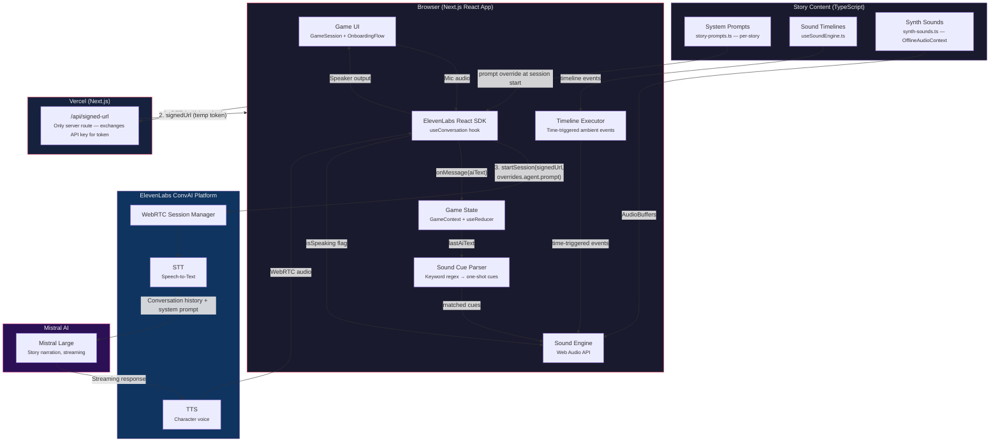

# InnerPlay -- Close Your Eyes. Speak. Play.

**A voice-only immersive game engine where players close their eyes and interact with AI characters through speech alone, powered by Mistral Large for dynamic narration and ElevenLabs for real-time voice.**

---

## The Problem

8 billion people carry the most powerful imagination engine ever created -- and use it to scroll TikTok.

- **Games are visual-first.** They exclude visually impaired users, demand screens, and create fatigue.
- **Interactive fiction is stuck in text boxes.** It hasn't evolved with AI.
- **Voice AI is used for assistants and customer service** -- never for entertainment, never for immersive storytelling.

There is no product that combines AI narration + voice interaction + cinematic sound design + imagination-based gameplay. **InnerPlay is that product.**

---

## The Solution

InnerPlay **breaks the "text box" paradigm completely**. There is zero visual UI during gameplay.

Players **put on headphones, close their eyes, and speak**. That's the entire interface.

- AI characters respond in real-time with emotional, contextual narration
- A deterministic sound engine builds and dismantles a world around you over time
- Spatial sound design (3D audio, ambient layers, subtractive horror cues) creates a world you *hear* rather than see
- Stories are system prompts and TypeScript timelines -- the engine is genre-agnostic and extensible

**The ritual entry IS the game.** The phone rings. You pick up. The voice on the other end needs your help. The ambient layers begin. You are inside the story before you realize it started.

---

## Featured Story: "The Call"

A **10-minute survival thriller with a time loop**.

Your phone rings. You answer. A stranger named Alex is trapped somewhere underground -- concrete room, metal door, no handle on their side. Your number was the only one that connected. You are their only lifeline.

**You guide. Alex acts.**

- Alex describes the space in real time: the keypad, the vent, the pipes, the sounds from somewhere below
- You choose the path. Every wrong choice ends fatally
- When Alex dies, the phone goes quiet. Then it rings again: "Hello? Is... is someone there?"
- **The time loop is a game mechanic, not a narrative conceit.** Alex accumulates memory across deaths. By the third loop, Alex knows they've died before. Knows your voice. Needs you to get it right this time.

**Three revelation variants** determined by how you guide:
- Methodical and precise? Alex finds a screen showing you're not outside -- you're in a control room running the trial. You are the experiment.
- Emotionally present? Alex hears a recording of the call playing back things they haven't said yet. The phone call already happened. Alex may not be alive on this phone.
- Hesitant, second-guessing? Alex finds a room full of active phones -- your voice on every one, guiding different versions of Alex through different paths. None of them have made it out yet.

**The ending depends on a single final choice** -- open the door or wait -- and Alex's last words echo something from the very first exchange of this call, returned with different weight. Then the line simply goes quiet.

Built around a full authored system prompt with phase-aware narration, a time-loop mechanic, branching revelations, and a multi-layer synthetic soundscape driven by a deterministic timeline and keyword detection.

*3 stories coming soon: The Last Session, The Lighthouse, Room 4B.*

---

## How It Works

```
Player speaks
    |
    v
ElevenLabs ConvAI (WebRTC) -- captures voice, handles VAD + turn-taking
    |
    v
ElevenLabs forwards conversation history to Mistral Large directly
(system prompt injected from client at session start)
    |
    v
Mistral Large -- streams in-character narration
    |
    v
ElevenLabs TTS -- converts to character voice with emotional expression
    |
    v
WebRTC audio returns to browser
    |
    v
Client-side sound engine runs in parallel:
  - Keyword regex on AI narration text → fires reactive sound cues
  - Deterministic timeline → ambient layer progression
  - TTS ducking: -6dB when character speaks, restore when they stop
    |
    v
Player hears a living world through headphones
```

**There is no server in the voice path.** The only server route is `/api/signed-url`, which exchanges the secret API key for a short-lived token. Everything else -- game state, sound cues, transcript -- lives in the browser.

---

## Mistral AI Integration

Mistral Large is the voice of every character in InnerPlay.

### Mistral Large -- Story Narration Engine
- Generates all in-character dialogue and narration
- Called directly by ElevenLabs -- no custom webhook, no server hop in the voice path
- System prompt injected at session start via `overrides.agent.prompt.prompt` -- story context, character voice, phase arc, and forbidden phrases all loaded client-side
- **Token-by-token streaming** to ElevenLabs -- the player hears the character's first words while the rest of the response is still generating
- Self-manages phase progression based on exchange count, guided by the prompt

### Prompt Engineering: Story System Prompts
Each story has a single carefully authored system prompt that does the work of all per-turn context:
- **Character voice rules** -- forbidden phrases, sentence length, emotional register, what the character knows and doesn't
- **Phase arc** -- how the story should evolve across exchanges without explicit turn counting
- **Sound integration** -- instructions to describe things naturally (the keyword system handles audio; no `[SOUND:x]` markers needed)
- **Ending conditions** -- when and how the experience concludes

**Code decides the soundscape. LLM narrates the story.** The timeline executor, keyword detection, and TTS ducking are deterministic TypeScript. Mistral's only job is to be the character.

---

## Architecture: Direct-Wire, Browser-First

This is a **pipeline, not an agentic system**. No autonomous agents, no multi-step tool orchestration. ElevenLabs calls Mistral directly; the browser handles everything else.



| Component | What It Does | Tech |
|---|---|---|
| **Game State** | useReducer: status, elapsedSeconds, isSpeaking, transcript, conversationId | React (client-only) |
| **Sound Cue Parser** | Regex keyword match on AI narration text → one-shot cue IDs, 30s cooldown per sound | TypeScript |
| **Timeline Executor** | Pre-authored time-based events (fade_in, fade_out, hard_stop, mute_all) polled every 100ms | TypeScript |
| **Sound Engine** | Web Audio API: spatial channels, loop management, crossfade ducking, OfflineAudioContext synthesis | Web Audio API |
| **Story Prompts** | Per-story TypeScript strings injected at session start via ElevenLabs SDK override | TypeScript |
| **Synth Sounds** | Generates all audio procedurally in-browser (no audio files) | OfflineAudioContext |
| **/api/signed-url** | Only server-side route -- exchanges `ELEVENLABS_API_KEY` for short-lived signed URL | Next.js API Route |

---

## What Makes This Special

**1. Zero-UI gameplay.** Nothing like it exists. You close your eyes to play. The screen goes dark. Your imagination is the renderer.

**2. Direct-wire AI voice.** ElevenLabs calls Mistral directly -- no intermediary server, no session store, no polling. The system prompt is injected from the client at session start. Voice-to-voice latency is ~1-1.5 seconds.

**3. Sound as a game mechanic.** Two parallel systems drive the soundscape: a deterministic timeline (authored events at specific timestamps) and a keyword detection layer (AI says "footsteps" → footsteps play). Neither requires the AI to do anything special.

**4. All sounds synthesized in-browser.** Every ambient layer, every one-shot cue -- generated procedurally via `OfflineAudioContext`. No audio files to serve. No CDN latency. The entire sound palette is parameterized TypeScript.

**5. Subtractive sound design.** Horror and tension through *removal*. Sounds disappear. Static intensifies. The phone line degrades. Your brain fills the silence.

**6. Provider-agnostic engine.** The story content, prompt system, and sound engine are decoupled from the AI provider. The system prompt approach works with any LLM ElevenLabs supports. Built for portability.

---

## Technical Stack

| Component | Technology |
|---|---|
| Framework | Next.js 16 (React 19, TypeScript, App Router) |
| AI Narration | Mistral Large (`mistral-large-latest`) via ElevenLabs agent config |
| Voice I/O | ElevenLabs Conversational AI (WebRTC, STT, TTS) |
| Client State | React useReducer (GameContext) -- no server session store |
| Audio Engine | Web Audio API (spatial sound, ambient layers, dynamic mixing, OfflineAudioContext synthesis) |
| Story Content | TypeScript (system prompts, sound timelines, keyword rules) |
| Source Code | ~40 TypeScript files |
| Server Routes | 1 API route: `/api/signed-url` |
| Deployment | Vercel (serverless) |
| SDK | `@elevenlabs/react` 0.14.1 |

---

## Neuroscience-Backed Design

Every design decision has a research basis:

- **Loose sketches for onboarding** (not photorealistic) -- forces top-down cortical imagery activation (Kosslyn 2003)
- **10-12 minute sessions** -- alpha power peaks at minute 14, no benefit beyond 20 (Zemla 2023)
- **Sub-bass at 20-30 Hz** -- triggers unease without conscious awareness (Tandy 1998)
- **Silence before the scare** -- brain fills silence with imagination; 2s silence > any loud sound
- **Dread 80%, Terror 15%, Horror 5%** -- Orson Scott Card's hierarchy. Alien shows 4 minutes of monster in 117 minutes of film.
- **Sounds disappearing = dread** -- subtractive sound design is more effective than additive for horror
- **Somatic suggestion** ("You feel the cold floor under your feet") -- works without hypnosis in eyes-closed states (Markmann 2023)

---

## Try It

**Live demo**: [https://mistral-lac.vercel.app](https://mistral-lac.vercel.app)

Put on headphones. Close your eyes. Answer the call.

---

## Team

Solo developer -- Akash Manmohan

---

## Repository

[https://github.com/AkashiGhost/mistral](https://github.com/AkashiGhost/mistral)
